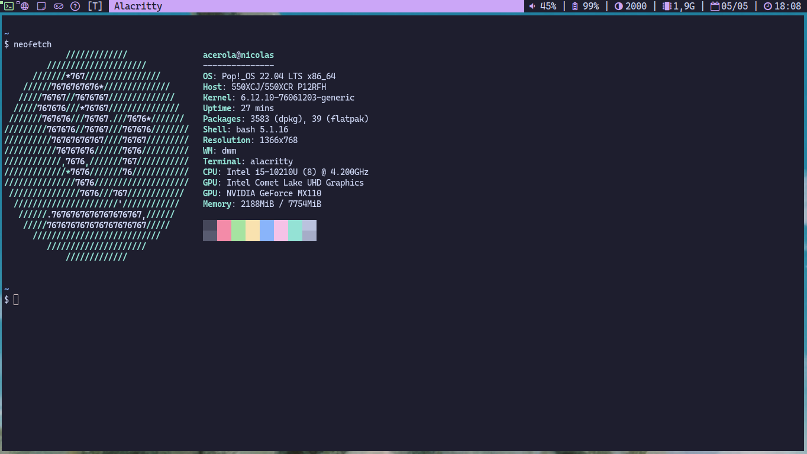

# Dwm



## Notes

I'm using `pulseaudio` for audio management and `brightnessctl` to change the screen brightness.

[Alacritty](https://alacritty.org) is my terminal. I personally recommend [build it for source](https://github.com/alacritty/alacritty/blob/master/INSTALL.md)

## Dependencies

In Ubuntu/Debian:

``` bash
sudo apt install rofi feh brightnessctl
```
